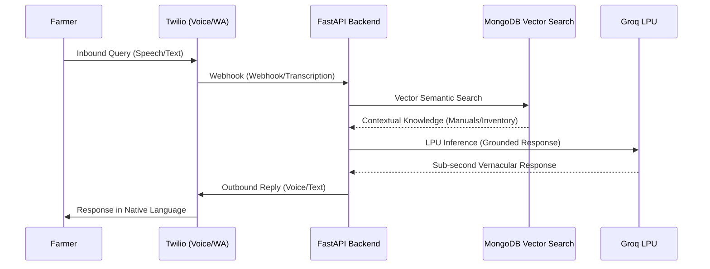

<p align="center">
  
</p>

<h1 align="center">Syngenta Agri-AI Platform</h1>
<p align="center"><strong>Multimodal Marketing &amp; Conversational Intelligence</strong></p>

<p align="center">
  
  
  
  
  
  
  
</p>

<p align="center">
  The Syngenta Agri-AI Platform is a high-fidelity orchestration engine designed to bridge the gap between complex agricultural science and the smallholder farmer. Developed for the <strong>Syngenta Hackathon (Track 1)</strong>, the platform delivers the right message, for the right product, at the biological moment of need.
</p>

---

##  Strategic Advantages

### 1. Predictive Receptivity Scoring
Utilizes an **XGBoost machine learning model** to analyze historical engagement, farm size, and rep visit logs. The platform predicts the probability of a farmer taking action, enabling targeted marketing that delivers a documented **3x lift** in conversion rates.

### 2. Omnichannel Accessibility (Inclusive Design)
Directly addresses the "feature phone and low literacy" challenge. Our dynamic router detects the user's device and connectivity:
- **Smartphone Users:** Hyper-personalized, vernacular WhatsApp messages with real-time weather context.
- **Feature Phone Users:** Automated Voice Calls (IVR) in native languages, ensuring critical crop protection advice is never gated by technology.

### 3. Grounded Conversational RAG
A sub-second, two-way AI helpline powered by **Groq (LPU Inference)** and **MongoDB Atlas Vector Search**. Over 12,000 knowledge chunks — including product manuals and local retailer inventory — are vectorized to provide factual, grounded answers.

### 4. 3D Market Intelligence
High-performance geospatial heatmaps using **Deck.gl 3D visualization**. By projecting grower density and farm size into 3D space over a Carto Dark Matter base, executives can surgically identify emerging market opportunities.

---

##  Technical Architecture

### The Stack

| Layer | Technology |
| :--- | :--- |
| **Intelligence** | Groq LPU Inference, Google Gemini 2.5 Flash, XGBoost |
| **Backend** | FastAPI (Python), MongoDB Atlas (Vector Search), Meteoblue Weather API |
| **Frontend** | React 19, Vite, Deck.gl (3D Hexagon Layers), MapLibre GL, Recharts |
| **Telephony** | Twilio Voice & WhatsApp Business API |
| **Observability** | Datadog (APM, RUM, Log Correlation) |

### Inbound RAG Workflow



---

##  Observability

The platform is instrumented with **Datadog** for enterprise-grade monitoring:

| Signal | Coverage |
| :--- | :--- |
| **APM** | End-to-end tracing for AI inference and database queries |
| **RUM** | Real User Monitoring for frontend performance and error tracking |
| **Log Correlation** | Seamless navigation between traces and structured logs via `structlog` |

---

##  Developer Guide

### Prerequisites
- Python 3.10+
- Node.js 20+
- MongoDB Atlas Cluster (with Vector Search enabled)
- API Keys: Gemini, Groq, Twilio, Meteoblue, Datadog

### Environment Setup

Create a `.env` file in the root directory (refer to `.env.template`):

| Variable | Description |
| :--- | :--- |
| `GEMINI_API_KEY` | Google AI Studio Key |
| `GROQ_API_KEY` | Groq Console Key |
| `MONGODB_URI` | MongoDB Atlas Connection String |
| `TWILIO_ACCOUNT_SID` | Twilio SID |
| `METEOBLUE_API_KEY` | Meteoblue Weather API Key |
| `DD_API_KEY` | Datadog API Key (for observability) |

### Installation

#### Backend
```bash
cd backend
python -m venv venv
source venv/bin/activate
pip install -r requirements.txt
./startup.sh
```

#### Frontend
```bash
cd frontend
npm install
npm run dev
```

### ML & Data Pipelines
- **Knowledge Ingestion:** `python backend/scripts/vectorize_knowledge.py` — indexes PDFs and product manuals into MongoDB Atlas.
- **Model Training:** `python ml/train_model.py` — retrains the XGBoost receptivity model.

---

##  Project Structure

```text
├── backend/            # FastAPI Application
│   ├── models/         # Pydantic Schemas
│   ├── routers/        # API Endpoints (Campaigns, RAG, Voice)
│   ├── services/       # Core Logic (Content Gen, Weather, RAG)
│   └── scripts/        # Data Vectorization & Ingestion
├── frontend/           # React + Vite + Deck.gl
├── ml/                 # XGBoost Receptivity Model & Training
└── docs/               # Architecture Specs & Design Docs
```

---

<p align="center">Built for the <strong>Syngenta Hackathon 2026</strong></p>
