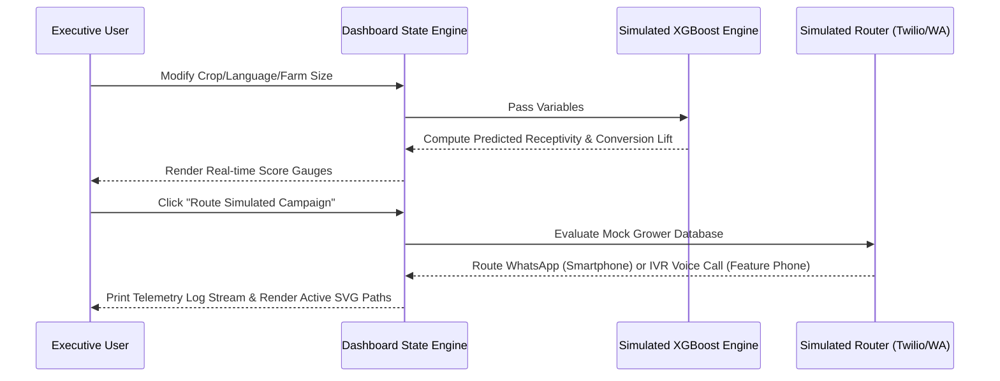

# Design Spec: MongoDB-Style Strategic Agri-AI Dashboard

This specification outlines the architecture, visual design, and functional workflows for enhancing the Syngenta Agri-AI Platform's campaign intelligence dashboard, fully reimagined in the MongoDB Atlas dark-mode design system using strictly SVG elements.

---

## 1. Objectives & Success Criteria
*   **Design Alignment**: Fully align the dashboard design system with the premium dark theme of MongoDB Atlas, utilizing the Spring Green accent palette.
*   **Zero Emojis**: Enforce strict SVG usage across the entire UI. Replace all plain textual statuses or visual indicators with rich SVGs.
*   **Strategic Insights**: Integrate real-time diagnostic consoles for MongoDB Atlas Vector Search telemetry, XGBoost predictive receptivity simulators, and live Twilio omnichannel routing simulations.
*   **Interactive Simulation**: Deliver fully functional, high-fidelity mock controls that simulate live backend processes directly from the client.

---

## 2. UI Layout & Architecture

The dashboard will be split into a rich grid-based workspace:
*   **Row 1: Connection Diagnostics (KPI Tag Row)**: Showcase high-fidelity status tags mapping cluster availability, ML score sync, and telephony router performance.
*   **Row 2: Dual Core Panels (50/50 Grid)**:
    *   *Panel A (MongoDB Vector Telemetry)*: Live metadata displaying index health, search lookup latencies, and active semantic queries streams.
    *   *Panel B (XGBoost Receptivity & Conversion Simulator)*: Visual distribution metrics mapping High/Medium/Low engagement tiers coupled with user-controlled parameters to simulate conversion lifts.
*   **Row 3: Dual Execution Panels (50/50 Grid)**:
    *   *Panel C (Omnichannel Routing Simulator)*: A live simulation module tracing user device types and executing target campaigns via hyper-personalized WhatsApp (for smartphones) or Twilio Voice IVR (for feature phones) alongside active JSON telemetry outputs.
    *   *Panel D (WhatsApp Engagement Chart & Weekly Funnels)*: The existing Recharts graph and campaign funnel logs adjusted to the MongoDB spring green gradients.

---

## 3. Data Flow & Simulated Telemetry

---

## 4. Components & Interactive Specifications

### A. `MongoDB Vector Search Telemetry`
*   **Cluster Metrics**: Display mock metrics representing standard cluster states:
    *   `Cluster Status`: Active / Healthy
    *   `Vector Lookup Latency`: 28ms avg
    *   `Dimensions`: 1536 (Gemini)
*   **Semantic Query Stream**: Showcase live agricultural search questions representing farmer queries from helplogs, updating asynchronously on the dashboard.

### B. `XGBoost Receptivity Simulator`
*   **Interactive Controls**:
    *   Crop Selection Dropdown
    *   Language Selection Dropdown
    *   Farm Hectares Input Range
*   **Live Prediction Formula**: Calculate conversion lift dynamically:
    *   *Formula*: `Base Lift * (Crop Coefficient) * (Farm Size multiplier) * (Language weights)`
    *   Updates active visual gauges to indicate campaign viability instantly.

### C. `Omnichannel Telephony Simulator`
*   **Mock Grower Database**: Display a structured table of growers with specific device characteristics.
*   **Omnichannel Device Router**:
    *   Evaluate if the target grower has a smartphone or feature phone.
    *   Trigger an active path animation:
        *   Smartphone -> WhatsApp delivery pipeline (rendered as bubble message preview with delivered markers).
        *   Feature Phone -> Twilio voice call pipeline (rendered as IVR step-by-step trace).
    *   Print raw system JSON logs in a mini-terminal below for developers and business operators.

---

## 5. Security & Isolation Guidelines
*   **Client Isolation**: The entire simulation layer is built completely client-side in React state, maintaining high-fidelity visuals without mutating any persistent cluster databases or calling outbound live external Twilio accounts.
*   **Styling Boundaries**: Custom CSS variables defined globally inside `index.css` are scoped exclusively using custom component classes, ensuring design compliance without visual leakage.
